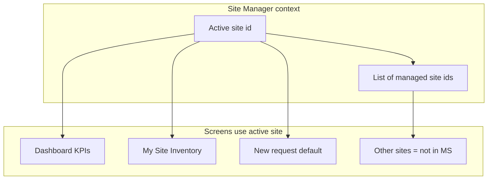

# Multi-site Site Manager (plan)

## Relationship rules (explicit)

| Rule                                     | Status                                                                                                                                                                                                                                |
| ---------------------------------------- | ------------------------------------------------------------------------------------------------------------------------------------------------------------------------------------------------------------------------------------- |
| **One site has at most one manager**     | **Yes — stays enforced.** Each `sites` document has a single `managerId` (and `managerName`). Admin UI keeps **one** manager per site via `SiteManagerSelector` (single selection). We are **not** adding multiple managers per site. |
| **One manager may manage several sites** | **This is what we add** by removing the app logic that previously **unassigned** that manager from other sites when assigning them to a new site.                                                                                     |

**Summary:** Cardinality is **many sites → one manager each** (unchangedfield shape), and we allow **one manager → many sites** (remove exclusivity on the manager side only).

## What changes in implementation

- Remove exclusivity in [sitesThunks.ts](../../src/store/thunks/sitesThunks.ts) (RN + web): stop clearing `managerId` on *other* sites when a manager is chosen for *this* site.
- Simplify [SiteManagerSelector](../../src/components/Sites/SiteManagerSelector.tsx): remove “manager already assigned elsewhere” **blocking** confirmation (optional non-blocking note only).
- Introduce **active managed site** context in Redux + persistence so dashboards, “my” inventory, and default request site refer to the **selected** site among all sites where `managerId === current user`.
- Update selectors and screens that used `selectAssignedSiteIdForUser` (first match only) to use **managed sites list + active site id**.

## What does not change

- Firestore schema for sites (still one `managerId` per site).
- Firestore rules: `isAssignedSite(siteId)` still checks that **that** site’s `managerId` matches the user.
- Cloud Functions: clearing all `managerId` fields where `managerId == userId` on role change remains valid.

## Site Manager application view (RN + web)

**Problem:** The SM experience was built around **one** “my site” and one **My Site Inventory**. With multiple managed sites there are **multiple site inventories** (each still a separate Firestore `locationId`), but the user needs a **single clear context** (“which site am I acting for?”) everywhere, not duplicate tabs per site.

**Principles (from CIAMS design system):** industrial clarity, trust through structure, **48px minimum touch targets**, scannable hierarchy, **one primary action per screen**, progressive disclosure, empty states that teach the next step.

### Global: active site context

- **Active site** is the SM’s working context for: dashboard KPIs, **My Site Inventory**, default destination for **new material requests**, and **recent/pending requests** widgets scoped to that site where the product already filters by `siteId`.
- **Always visible** on SM-facing screens: the **current site name** (card title / header subtitle / compact bar). Use **Site Manager role accent** for the site badge only: amber-brown token (`#B45309` family) at badge opacity `/15` for background, full color for label text — consistent with “role badges” in CIAMS, without turning the whole header into decoration.
- **Switcher** (when **two or more** managed active sites):
  - **Placement:** directly under the screen title or in the **inventory sub-nav** row — one predictable location across Inventory + Dashboard, not a different pattern per screen.
  - **Control:** RN — tappable row or bottom sheet list (full list with search if many sites); Web — `select`-style or popover list with **min 44–48px** row height.
  - **Not** a second “primary” blue button; use **outline** or **ghost** affordance so the main CTA (e.g. New Request) stays the single primary blue action.
- **One managed site:** **Progressive disclosure** — show site name as **read-only caption** next to the title; **hide** the switcher entirely (no fake one-item dropdown).

### Inventory module (SM)

- **My Site Inventory** shows stock **only for the active site** (same data model as today: `locationId = site_<siteDocId>`). Do **not** merge quantities across sites in one list — that would confuse accountability and requests.
- **Other Sites:** list = active sites **excluding all IDs the user manages** (not “all minus one”). Copy under the section title stays honest: e.g. “Sites you don’t manage — view only; request transfers to .”
- **Opening another site’s inventory** remains read-only; transfer CTAs use **managed site set** + active site as default destination where applicable.
- **Cards:** keep the standard CIAMS list card (`rounded-[10px]`, `p-4`, `border-[#E2E8F0]`, `gap-3` between cards). **Status first** on any row that has a status (e.g. low stock badge top-right).

### Dashboard (SM)

- KPI strip (e.g. items in stock at **this** site, pending count) reflects **active site** only; subscription loads inventory for **that** `locationId` to avoid N simultaneous heavy listeners.
- If **no** managed sites: full **empty state** (icon, `text-[22px]` title, `text-[15px]` secondary body, optional link to contact admin) — same empty-state pattern as CIAMS.

### Requests (SM)

- **Create request** defaults to **active site** as `siteId`; if the flow allows override, keep it rare and secondary.
- **My requests** list: if the product already mixes all requests for the user, optional **filter chip** “This site” vs “All” can be a follow-up; minimum scope is **create** and **dashboard** using active site consistently.

### Profile

- Replace single “Assigned site” line with **“Managed sites”**: list of names (and addresses if space), with **“Active: ****”** or equivalent so the mental model is explicit.

### Web vs native parity

- Same **active site** state machine, persistence, and screen behavior; web uses existing Tailwind/CIAMS web spacing and typography scale aligned to the same numeric scale (`22px` titles, `15px` body, `13px` meta).

## Testing (high level)

- Assign manager M to site A and site B: both sites show M; **neither** site has two managers.
- Manager M switches active site; inventory/dashboard follow active site.
- **SM UX:** With **one** managed site, switcher is **hidden**; site name still visible. With **two+**, switcher appears and updates **My Site Inventory** and dashboard without merging lists.
- **Other Sites** excludes **all** managed sites, not “all minus one.”
- Inactive site still clears manager on update (existing thunk behavior).

