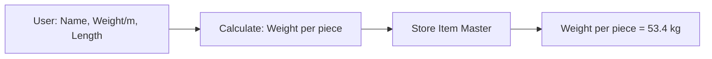
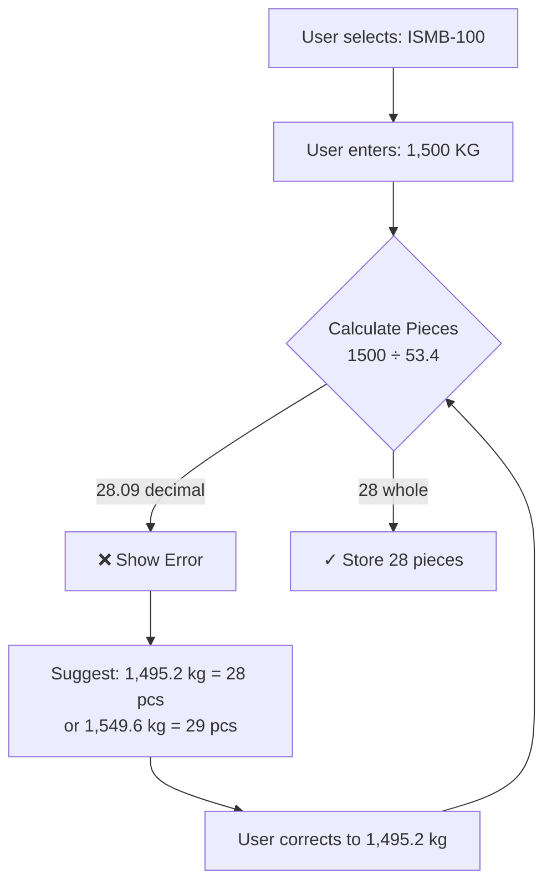
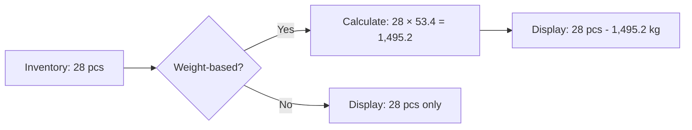
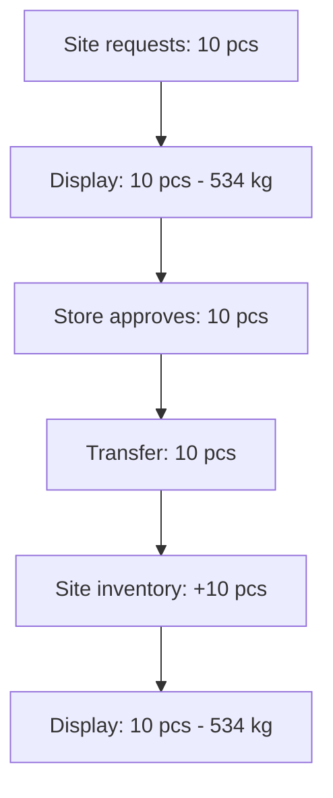

# Steel Weight Calculation Implementation Plan

## Summary

Add support for steel items with standard chartered weights. Users enter **total KG received**, and the system calculates pieces using: **Pieces = Total KG ÷ (Weight per meter × Standard Length)**. System validates whole pieces and rejects decimals with helpful error messages. All views display both pieces and weight (convertible). Ton (MT) works same as KG (1 Ton = 1,000 KG).

---

## Data Model Changes

### 1. Item Types (`[src/types/inventory.ts](asset-manager/src/types/inventory.ts)`)

Add optional fields to `FirestoreItem`, `Item`, `CreateItemData`, and `UpdateItemData`:

```ts
weightPerMeter?: number;   // kg/m, from standard chartered weights (e.g. 8.9 for ISMB-100)
lengthPerPiece?: number;  // meters, default length when adding stock (e.g. 6)
```

- `weightPerMeter`: Used for weight calculation; when present, item is treated as weight-based.
- `lengthPerPiece`: Default length when creating/adding stock; can be overridden per transaction.

### 2. Inventory Types (`[src/types/inventory.ts](asset-manager/src/types/inventory.ts)`)

Add optional field to `FirestoreInventoryEntry` and `InventoryEntry`:

```ts
lengthPerPiece?: number;  // meters, length of pieces at this location
```

- Set when creating inventory or adding stock for weight-based items.
- Copied from source when transferring (store → site).

### 3. AdjustmentData (`[src/types/inventory.ts](asset-manager/src/types/inventory.ts)`)

Add optional field for add-type adjustments:

```ts
lengthPerPiece?: number;  // required when adding stock for items with weightPerMeter
```

---

## Utility: Weight Calculation

### 4. Create Weight Helper (`[src/utils/weightUtils.ts](asset-manager/src/utils/weightUtils.ts)` - new file)

```ts
/**
 * Calculate total weight for steel items.
 * Formula: weightPerMeter (kg/m) × lengthPerPiece (m) × quantity
 */
export function calculateWeight(
  weightPerMeter: number,
  lengthPerPiece: number,
  quantity: number
): number;

/** Check if item supports weight calculation */
export function isWeightBasedItem(item: { weightPerMeter?: number }): boolean;
```

---

## Backend / Service Changes

### 5. Inventory Service (`[src/services/firebase/inventoryService.ts](asset-manager/src/services/firebase/inventoryService.ts)`)

- **createItem**: Accept `weightPerMeter`, `lengthPerPiece` in `CreateItemData`. When both are present and `initialQuantity > 0`, set `lengthPerPiece` on the initial central-store inventory entry.
- **adjustQuantity**: Accept optional `lengthPerPiece` in `AdjustmentData`. For `type === 'add'` and item has `weightPerMeter`, require `lengthPerPiece` and persist it when creating/updating inventory (new entry: set it; existing: update if provided).
- **firestoreItemToItem / firestoreInventoryEntryToInventoryEntry**: Map new optional fields.
- **listItems / getItemById / subscribeItems / subscribeInventoryByLocation**: Include new fields when reading from Firestore.

### 6. Request Service (`[src/services/firebase/requestService.ts](asset-manager/src/services/firebase/requestService.ts)`)

- **transferRequest**: When creating a new site inventory entry, copy `lengthPerPiece` from the central store inventory for that item (if present).
- **returnItems**: No change; returns use quantity only; `lengthPerPiece` stays on inventory.

---

## UI Changes

### 7. UnitSelector (`[src/components/Inventory/UnitSelector.tsx](asset-manager/src/components/Inventory/UnitSelector.tsx)`)

Add `Pcs` to `COMMON_UNITS` for steel pieces (alongside existing `Nos`).

### 8. ItemForm (`[src/components/Inventory/ItemForm.tsx](asset-manager/src/components/Inventory/ItemForm.tsx)`)

- Add optional fields (shown when user wants weight-based items):
  - **Weight per meter (kg/m)** – number input
  - **Length per piece (m)** – number input (only when `weightPerMeter` is set)
- Validation: if `weightPerMeter` is set, require `lengthPerPiece` when `initialQuantity > 0` (create mode).
- Pass `weightPerMeter` and `lengthPerPiece` into `CreateItemData` / `UpdateItemData`.

### 9. Create Item Flow (`[src/screens/Inventory/AddEditItemScreen.tsx](asset-manager/src/screens/Inventory/AddEditItemScreen.tsx)`)

- Pass `weightPerMeter` and `lengthPerPiece` from ItemForm to `createItem` / `updateItem`.
- No other changes to screen logic.

### 10. Display Components – Show Weight When Applicable

Use `calculateWeight` and `isWeightBasedItem` to show weight alongside quantity where relevant.


| Component                                                                               | Change                                                                                                       |
| --------------------------------------------------------------------------------------- | ------------------------------------------------------------------------------------------------------------ |
| `[RequestItemCard](asset-manager/src/components/Requests/RequestItemCard.tsx)`          | Accept optional `item` prop; if `item?.weightPerMeter` and `item?.lengthPerPiece`, show "X pcs (Y kg)"       |
| `[RequestCard](asset-manager/src/components/Requests/RequestCard.tsx)`                  | Pass item data to RequestItemCard if available                                                               |
| `[ConfirmTransferScreen](asset-manager/src/screens/Requests/ConfirmTransferScreen.tsx)` | For each item, show "Qty: X (Y kg)" when weight can be calculated (need item lookup or pass through request) |
| `[ItemCard](asset-manager/src/components/Inventory/ItemCard.tsx)`                       | Show total weight under quantity when `isWeightBasedItem(item)` and `item.lengthPerPiece`                    |
| `[InventoryListItem](asset-manager/src/components/Inventory/InventoryListItem.tsx)`     | Accept optional `lengthPerPiece`; show "X pcs (Y kg)" when item has `weightPerMeter` and length              |
| `[ItemDetailScreen](asset-manager/src/screens/Inventory/ItemDetailScreen.tsx)`          | Show weight in Stock Distribution KPIs when item is weight-based                                             |


**Item lookup for requests**: Request items have `itemId` but not full item. Options:

- Fetch items by ID where requests are displayed, or
- Denormalize `weightPerMeter` and `lengthPerPiece` onto request items when creating the request (simpler for display).

Recommendation: Denormalize `weightPerMeter` and `lengthPerPiece` onto request items in `createRequest` and `editRequest` so display does not need extra fetches.

### 11. Request Types (`[src/types/request.ts](asset-manager/src/types/request.ts)`)

Add to `RequestItem`:

```ts
weightPerMeter?: number;
lengthPerPiece?: number;
```

Populate these when creating/editing requests from the selected item.

---

## Flow Diagrams

### Item Creation Flow


### Stock Entry Flow (Weight-Based)


### Display Flow


### Request & Transfer Flow



---

## Backward Compatibility

- All new fields are optional. Existing items and inventory entries continue to work.
- Firestore documents: new fields are omitted for old records; readers handle `undefined`.
- No migrations required; new fields apply only to new/updated data.

---

## Files to Modify


| File                                             | Changes                                                                                                                                                |
| ------------------------------------------------ | ------------------------------------------------------------------------------------------------------------------------------------------------------ |
| `src/types/inventory.ts`                         | Add `weightPerMeter`, `lengthPerPiece` to Item, FirestoreItem, CreateItemData, UpdateItemData, InventoryEntry, FirestoreInventoryEntry, AdjustmentData |
| `src/types/request.ts`                           | Add `weightPerMeter`, `lengthPerPiece` to RequestItem                                                                                                  |
| `src/utils/weightUtils.ts`                       | New: `calculateWeight`, `isWeightBasedItem`                                                                                                            |
| `src/services/firebase/inventoryService.ts`      | Handle new fields in createItem, adjustQuantity, mappers, subscriptions                                                                                |
| `src/services/firebase/requestService.ts`        | Copy lengthPerPiece on transfer; denormalize weight fields in createRequest/editRequest                                                                |
| `src/components/Inventory/UnitSelector.tsx`      | Add "Pcs"                                                                                                                                              |
| `src/components/Inventory/ItemForm.tsx`          | Add weightPerMeter, lengthPerPiece inputs and validation                                                                                               |
| `src/components/Inventory/ItemCard.tsx`          | Show weight when weight-based                                                                                                                          |
| `src/components/Inventory/InventoryListItem.tsx` | Show weight when weight-based (needs item or lengthPerPiece prop)                                                                                      |
| `src/components/Requests/RequestItemCard.tsx`    | Show weight when request item has weight fields                                                                                                        |
| `src/screens/Inventory/ItemDetailScreen.tsx`     | Show weight in stock KPIs                                                                                                                              |
| `src/screens/Requests/ConfirmTransferScreen.tsx` | Show weight per item when available                                                                                                                    |
| `src/screens/Requests/CreateRequestScreen.tsx`   | Pass weightPerMeter, lengthPerPiece when adding items to request                                                                                       |
| `src/screens/Requests/EditRequestScreen.tsx`     | Same as CreateRequestScreen for edit                                                                                                                   |


---

## Optional / Future

- **Adjust Quantity Screen**: If re-enabled, add `lengthPerPiece` input when adding stock for weight-based items.
- **Mixed lengths**: Current design assumes one length per location. Supporting multiple batches with different lengths would require batch/lot tracking (out of scope).

