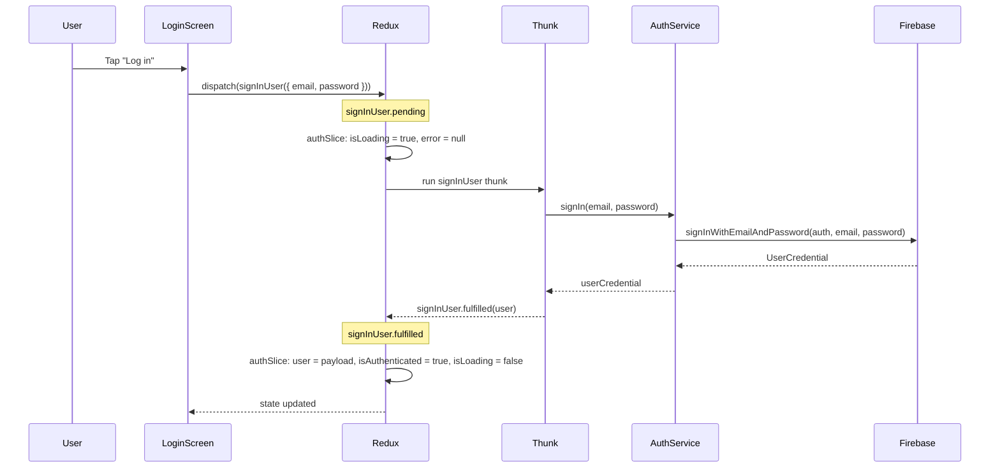
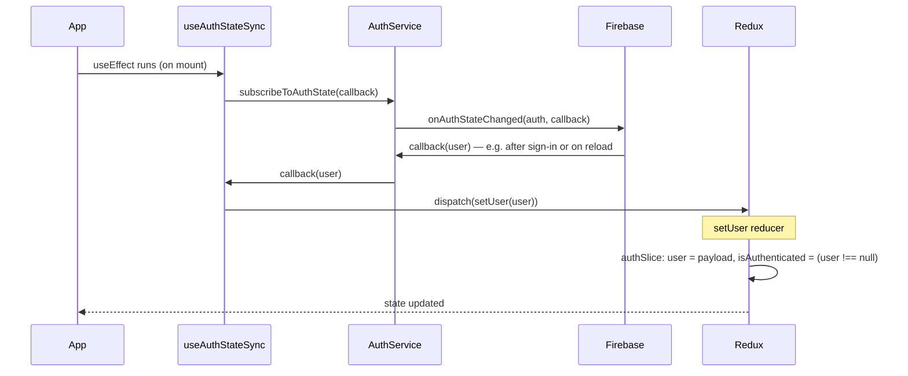

# How `isAuthenticated` Is Set — Step-by-Step

This document shows the two paths that update `isAuthenticated` in the Redux store.

---

## Where It Lives

```
┌──────────────────────────────────────────────────────────────┐
│  REDUX STORE                                                 │
│  state.auth = {                                              │
│    user: User | null,                                        │
│    isAuthenticated: boolean,   ← THIS FLAG                   │
│    isLoading: boolean,                                        │
│    error: string | null                                       │
│  }                                                           │
└──────────────────────────────────────────────────────────────┘
```

---

## Path 1: User Taps "Log in" (Sign-in flow)

This path runs when the user submits the login form. The thunk calls Firebase, then the slice sets `isAuthenticated`.



**Step-by-step (Path 1):**

| Step | Where | What happens |
|------|--------|----------------|
| 1 | `LoginSignupScreen` | User taps "Log in" → `handleSubmit()` runs |
| 2 | `LoginSignupScreen` | `dispatch(signInUser({ email, password }))` |
| 3 | `authSlice` | `signInUser.pending` → `isLoading = true`, `error = null` |
| 4 | `authThunks.ts` | Thunk calls `signIn(email, password)` from authService |
| 5 | `authService.ts` | `signInWithEmailAndPassword(auth, email, password)` → Firebase |
| 6 | Firebase | Validates credentials, returns `UserCredential` |
| 7 | `authThunks.ts` | Returns `userCredential.user` → Redux dispatches `fulfilled` |
| 8 | `authSlice` | **`signInUser.fulfilled`** → `user = payload`, **`isAuthenticated = true`**, `isLoading = false` |

---

## Path 2: App Load / Firebase Listener (Auth state sync)

This path runs when the app starts or when Firebase auth state changes (e.g. token refresh, sign-out elsewhere). No login form involved.



**Step-by-step (Path 2):**

| Step | Where | What happens |
|------|--------|----------------|
| 1 | `App.tsx` | `AppContent` renders → `useAuthStateSync()` runs |
| 2 | `useAuthStateSync` | `subscribeToAuthState(callback)` from authService |
| 3 | `authService.ts` | `onAuthStateChanged(auth, callback)` → Firebase listener registered |
| 4 | Firebase | Auth state changes (e.g. user signed in, or app reload with existing session) |
| 5 | Firebase | Calls your callback with `User \| null` |
| 6 | `useAuthStateSync` | `dispatch(setUser(user))` |
| 7 | `authSlice` | **`setUser` reducer** → `user = payload`, **`isAuthenticated = (payload !== null)`** |

---

## Both Paths in One Picture

```mermaid
flowchart TB
    subgraph UI["UI"]
        A[User taps Log in]
    end

    subgraph ReduxFlow["Redux flow"]
        B[dispatch signInUser]
        C[signInUser.pending]
        D[Thunk: signIn]
        E[signInUser.fulfilled]
        F["authSlice: isAuthenticated = true"]
    end

    subgraph FirebaseFlow["Firebase"]
        G[signInWithEmailAndPassword]
        H[Firebase Auth]
    end

    subgraph SyncFlow["Auth sync (always running)"]
        I[onAuthStateChanged]
        J[callback(user)]
        K[dispatch setUser]
        L["authSlice: isAuthenticated = (user !== null)"]
    end

    A --> B --> C --> D --> G --> H
    H --> E --> F

    I --> H
    H --> J --> K --> L
```

---

## Summary

| Path | Trigger | Who sets `isAuthenticated` |
|------|---------|----------------------------|
| **1. Sign-in** | User submits login form | `authSlice` in `signInUser.fulfilled` → `true` |
| **2. Sync** | App load or Firebase auth change | `authSlice` in `setUser` → `true` if `user !== null`, else `false` |

Both paths end in the **same place**: the `auth` slice in the Redux store. Components read it via `useAppSelector(selectIsAuthenticated)`.
